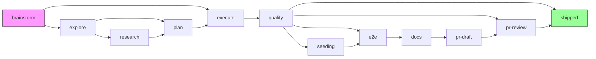
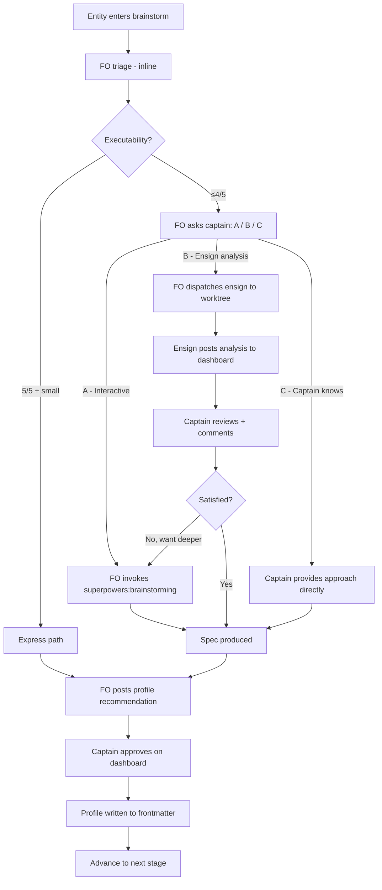
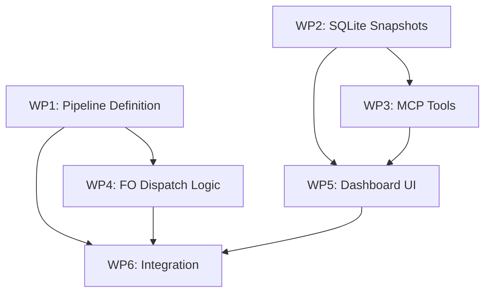

# Pipeline Brainstorm Stage + Adaptive Profiles

**Date:** 2026-04-08
**Status:** Draft
**Scope:** Build pipeline workflow — stage additions, MCP expansion, dashboard UI, FO dispatch logic

## Problem

The current 11-stage pipeline treats all entities identically. This causes two problems:

1. **Insufficient deliberation** — Entities created ad-hoc (e.g., bugs found during live testing) enter the pipeline without enough discussion on approach, scope, or alternatives. Ensigns get stuck or make suboptimal decisions.

2. **Excessive overhead for small changes** — A one-line fix goes through explore → research → plan → execute → quality → e2e → docs → pr-draft → pr-review. Most of these stages add zero value for trivial changes.

## Solution Overview

Two changes that work together:

1. **Brainstorm stage** — New initial stage before explore. Evaluates spec executability, facilitates captain collaboration on approach/scope, and assigns a profile.

2. **Adaptive profiles** — Three pipeline paths (full/standard/express) with per-entity overrides. Profile determines which stages an entity passes through.



**Profile stage composition:**

| Stage | full | standard | express |
|-------|:----:|:--------:|:-------:|
| brainstorm | ✅ | ✅ | ✅ |
| explore | ✅ | ✅ | |
| research | ✅ | | |
| plan | ✅ | ✅ | |
| execute | ✅ | ✅ | ✅ |
| quality | ✅ | ✅ | ✅ |
| seeding | ✅ | | |
| e2e | ✅ | | |
| docs | ✅ | | |
| pr-draft | ✅ | ✅ | |
| pr-review | ✅ | ✅ | |
| shipped | ✅ | ✅ | ✅ |

## Section 1: Pipeline Stage Definition

### README Frontmatter Changes

```yaml
stages:
  profiles:
    full:     [brainstorm, explore, research, plan, execute, quality, seeding, e2e, docs, pr-draft, pr-review, shipped]
    standard: [brainstorm, explore, plan, execute, quality, pr-draft, pr-review, shipped]
    express:  [brainstorm, execute, quality, shipped]
  defaults:
    worktree: true
    concurrency: 2
  states:
    - name: brainstorm
      initial: true
      model: sonnet
      worktree: false         # FO handles inline; path B ensign creates worktree as part of dispatch
      gate: true              # captain must approve profile + spec
    - name: explore
      profiles: [full, standard]
      model: sonnet
    - name: research
      profiles: [full]
      agent: auto-researcher
      model: opus
    - name: plan
      profiles: [full, standard]
      gate: true
      model: opus
    - name: execute
      model: opus
    - name: quality
      feedback-to: execute
      model: haiku
    - name: seeding
      profiles: [full]
      model: sonnet
    - name: e2e
      profiles: [full]
      gate: true
      model: sonnet
    - name: docs
      profiles: [full]
      model: sonnet
    - name: pr-draft
      profiles: [full, standard]
      model: sonnet
    - name: pr-review
      profiles: [full, standard]
      gate: true
      feedback-to: execute
      model: opus
    - name: shipped
      terminal: true
      worktree: false
```

Stages without a `profiles` field (execute, quality, shipped) run in **all** profiles.

### Entity Frontmatter

New fields added during brainstorm:

```yaml
profile: standard                  # assigned during brainstorm gate
skip-stages: []                    # optional override — remove stages
add-stages: []                     # optional override — add stages at canonical position
```

### Effective Stage List

```
effective = profiles[entity.profile]
          - entity.skip-stages
          + entity.add-stages (inserted at canonical position from full pipeline order)
```

`add-stages` insertion uses the `full` profile as canonical ordering. Example: adding `e2e` to a `standard` entity inserts it between `quality` and `pr-draft` (its position in `full`).

## Section 2: Brainstorm Stage Behavior

### 2.1 Executability Assessment

Brainstorm scoring measures **executability** — can an ensign complete this spec without getting stuck and needing captain intervention?

| Check | What it measures |
|-------|-----------------|
| **Intent clear** | Ensign knows what outcome to achieve |
| **Approach decidable** | Ensign can choose a method, or there's a trade-off requiring captain judgment |
| **Scope bounded** | Ensign knows what NOT to touch — won't scope-creep |
| **Verification possible** | Ensign can verify completion (test criteria, observable outcome) |
| **Size estimable** | FO can determine express/standard/full |

### 2.2 Brainstorm Flow



**Three paths:**

| Path | Trigger | Flow | When to use |
|------|---------|------|------------|
| **A) Interactive** | Captain wants to think through design | FO invokes superpowers:brainstorming, 1-on-1 Q&A | New features, architectural decisions |
| **B) Ensign analysis** | Spec has gaps but direction exists | Ensign explores codebase, produces approach options, posts to dashboard (see 2.5 Ensign Deliverable) | Bugs with unclear fix approach, medium features |
| **C) Direct** | Captain already knows the approach | Captain tells FO, FO updates spec | Clear bug fixes, follow-up work |

Paths can sequence: B → captain reviews → switches to A (with ensign's analysis as context).

FO recommends a path based on executability but captain always decides.

### 2.3 Entity Split

Brainstorm may determine an entity should split (e.g., 030 → 030a/b/c):

- FO creates child entity files with inherited metadata from parent
- Parent entity marked `status: split`, `split-into: [030a, 030b, 030c]`
- Each child entity gets `parent: 030` in frontmatter
- Each child starts at brainstorm with its own profile recommendation
- Express children auto-advance (captain already approved the split intent)

### 2.5 Brainstorm Ensign Deliverable (Path B)

When FO dispatches an ensign for path B, the ensign operates in a worktree (created by FO at dispatch time) and produces:

1. **Codebase exploration** — files relevant to entity scope, existing patterns, dependencies
2. **Approach options** — 2-3 alternatives with tradeoffs (markdown table)
3. **Profile recommendation** — full/standard/express with reasoning
4. **Open questions** — decisions that require captain judgment

The ensign posts its analysis via `add_comment` on the entity. The ensign is **read-only on the spec** — it comments but does not modify the entity body. Only FO updates the spec (via `update_entity`) after captain provides direction.

**Ensign spec writing guideline:** When explaining flows, architecture, or state transitions in entity specs, prefer mermaid diagrams over prose. The dashboard renders mermaid natively.

### 2.6 Brainstorm Gate

Captain approves via:
1. Dashboard approve button (click)
2. Comment override ("改成 full")
3. Channel message in entity detail feed or Claude Code terminal

Gate passes when profile is assigned and captain has explicitly approved.

## Section 3: MCP Tool Expansion

### 3.1 Tool List

| Tool | Purpose | Permission required |
|------|---------|-------------------|
| `reply({ content, entity? })` | Broadcast to activity feed. Optional `entity` scopes to entity detail feed. | No |
| `get_comments({ entity })` | Read entity's comment threads + feedback | No |
| `add_comment({ entity, section_heading?, content })` | FO posts comment on entity (brainstorm analysis, questions, status) | No |
| `reply_to_comment({ entity, comment_id, content, resolve? })` | FO replies to specific thread, optionally resolving it | No |
| `update_entity({ entity, reason, frontmatter?, body?, sections? })` | Update entity spec. `body` and `sections` are mutually exclusive. | `body` and `sections.remove` require permission with diff preview |

### 3.2 update_entity Detail

**Frontmatter** — partial merge with existing frontmatter:

```typescript
frontmatter?: {
  profile?: "full" | "standard" | "express",
  "skip-stages"?: string[],
  "add-stages"?: string[],
  status?: string
  // ...any other frontmatter field
}
```

**Body** — full markdown replacement (mutually exclusive with `sections`):

```typescript
body?: string    // replaces entire entity body, snapshot protection
```

**Sections** — heading-targeted operations (mutually exclusive with `body`):

```typescript
sections?: Array<{
  heading: string,               // fuzzy match on heading text
  action: "replace" | "append" | "remove",
  content?: string               // required for replace/append
}>
```

**Section targeting:** Markdown sections are delimited by headings. A section spans from its heading to the next heading of equal or higher level, or EOF. Fuzzy matching: `"Bug B"` matches `"## Bug B — FO Reply"` if unambiguous. Ambiguous matches return an error.

**Snapshot integration:** Every `update_entity` call:
1. Saves current state as snapshot (version N)
2. Applies changes
3. Saves new state as snapshot (version N+1) with author + reason
4. Auto-resolves open comments on updated sections (`resolved_reason: "section_updated"`)
5. Publishes `entity_updated` event to dashboard

**Permission flow for body/remove:**
1. MCP server computes diff (current vs proposed)
2. Sends `permission_request` event with diff preview to dashboard
3. Holds update pending
4. Captain approves → apply + snapshot
5. Captain denies → reject, FO notified

### 3.3 Entity Resolution

All tools use entity `slug` (not file path):

```
slug → docs/build-pipeline/{slug}.md
     → fallback: docs/build-pipeline/_archive/{slug}.md
     → not found: error
```

This is workflow-agnostic — the MCP server reads the workflow directory from the entity path prefix in the workflow's README frontmatter location. For build-pipeline: `docs/build-pipeline/`. For other workflows: wherever their README.md lives. The server discovers this at startup from `{workflow_dir}/README.md`.

### 3.4 Comment Notification via Channel

When captain adds a comment or reply on the entity detail page, FO needs to be notified. This uses the existing Claude Code channel infrastructure (`onChannelMessage` in `channel.ts`):

1. Captain adds comment → server stores in sidecar (existing)
2. Server publishes `comment` event to WS subscribers (existing)
3. Server forwards to FO via `onChannelMessage` with metadata:
   ```typescript
   { type: "comment_added", entity: "030b", comment_id: "xxx" }
   ```
4. FO receives channel notification → calls `get_comments` → reads and responds

No new infrastructure needed — the channel notification path already exists. The only change is ensuring comment/reply HTTP handlers call `onChannelMessage` with structured metadata so FO can distinguish comment notifications from other channel messages.

### 3.5 Tool Registration

All tools registered in `channel.ts` alongside existing `reply` tool. Same `CallToolRequestSchema` handler, expanded `ListToolsRequestSchema`.

## Section 4: SQLite Snapshot System

### 4.1 Schema

```sql
CREATE TABLE entity_snapshots (
  id                    INTEGER PRIMARY KEY AUTOINCREMENT,
  entity                TEXT NOT NULL,           -- slug
  version               INTEGER NOT NULL,        -- auto-increment per entity
  body                  TEXT NOT NULL,            -- full markdown content
  frontmatter           TEXT,                     -- JSON string
  author                TEXT NOT NULL,            -- "FO", "Kent", etc.
  reason                TEXT NOT NULL,            -- human-readable change description
  source                TEXT DEFAULT 'update',    -- 'update' | 'rollback' | 'create'
  rollback_from_version INTEGER,                  -- if source='rollback'
  rollback_section      TEXT,                     -- if source='rollback', heading text
  created_at            TEXT NOT NULL
);

CREATE UNIQUE INDEX idx_entity_version ON entity_snapshots(entity, version);
```

### 4.2 API Endpoints

| Endpoint | Method | Purpose |
|----------|--------|---------|
| `/api/entity/versions?entity={slug}` | GET | List all versions with metadata |
| `/api/entity/diff?entity={slug}&from={v}&to={v}` | GET | Section-aware diff between two versions |
| `/api/entity/rollback` | POST | Rollback specific section to specific version |

### 4.3 Section-Level Rollback

Rollback = "take section X's content from version Y, insert into current document, create new version."

```
POST /api/entity/rollback
{
  entity: "030b",
  section_heading: "## Bug B — FO Reply",
  to_version: 3
}

Response: {
  new_version: 6,
  warning: "Other sections modified since v3: ## Acceptance Criteria (v5)"
}
```

Conflict detection is **warning-only, not blocking**:
- Check if other sections were modified between target version and current
- If yes: return warning listing modified sections
- Captain decides whether to proceed
- Every rollback creates a new version — can always rollback the rollback

## Section 5: Comment Lifecycle

### 5.1 Comment Schema

```typescript
interface Comment {
  id: string;
  entity_path: string;
  selected_text: string;            // original text when comment was created
  section_heading: string;          // which section this comment targets
  content: string;
  author: string;                   // free string: "Kent", "FO", "Alice"
  author_role?: string;             // "captain" | "fo" | "reviewer" | "guest"
  timestamp: string;
  resolved: boolean;
  resolved_reason?: "manual" | "section_updated";
  resolved_at_version?: number;     // snapshot version that triggered auto-resolve
  thread: Reply[];
}
```

### 5.2 Resolution Rules

1. **Auto-resolve on section update** — When FO updates a section via `update_entity`, open comments targeting that section are auto-resolved with `resolved_reason: "section_updated"` and `resolved_at_version`.

2. **Manual resolve** — Any user can click resolve on any open thread (Notion-style).

3. **Unresolve** — Any user can reopen any resolved thread (auto or manual).

4. **Resolved threads preserved** — Never removed. Collapsed in comment panel, expandable to see full thread history. Each preserves `selected_text` so the original context is visible even after section content changes.

## Section 6: Dashboard UI Changes

### 6.1 Entity Detail Page — 3-Panel Layout

```
+--------+-----------------------------+-----------------------+
|        |                             |                       |
| Phase  |  Spec Panel                 |  Comment Panel        |
| Nav    |  (markdown render)          |  (threads)            |
|        |                             |                       |
| ● bra  |  Select text → comment      |  Open threads (N)     |
| ○ exp  |                             |  Resolved threads (N) |
| ○ pln  |                             |  [+ New Thread]       |
| ...    |                             |                       |
|        |                             |                       |
+--------+-----------------------------+-----------------------+
|  Entity Activity Feed               [Stage▾] [Type▾] [Who▾] |
|  (entity-scoped events + chat input)                         |
|  +----------------------------------------------+            |
|  | Type a message about this entity...   [Send] |            |
|  +----------------------------------------------+            |
+--------------------------------------------------------------+
```

**Interactions:**
- Select text in spec → popup "Add Comment" → creates section-targeted comment
- Comment panel: open/resolved threads, resolve/unresolve buttons
- Activity feed: entity-scoped events + chat input for general discussion
- Phase nav: `[Approve]` button during brainstorm gate
- `[History]` toggle to switch spec panel to version history view

### 6.2 Comment Panel — Notion-style

- Open threads sorted by time (newest first)
- Resolved threads collapsed, showing one-line summary + resolve reason
- Click resolved thread → expand full thread history
- Each thread: `[✓ Resolve]` (open) or `[↩ Unresolve]` (resolved)
- Markdown rendering in comment content
- `selected_text` displayed as blockquote at top of comment

### 6.3 Version History View

Replaces spec panel when `[History]` is toggled:

- Version timeline (list of all versions with author, reason, timestamp)
- Diff picker: select any two versions to compare
- Section-aware diff rendering: unchanged sections collapsed, changed sections show inline diff
- Per-changed-section `[⏪]` rollback button
- Rollback confirmation dialog with warning if other sections modified since target version

### 6.4 Global Feed Filters

Filter bar on home page:

- Entity filter (multi-select dropdown)
- Stage filter
- Type filter
- Author filter
- Filters stack with AND logic
- URL querystring reflects active filters (shareable)

### 6.5 Entity Detail Feed Filters

Same filter types minus entity (already scoped):

- Stage filter
- Type filter (comment, entity_updated, stage_start, stage_complete, gate_approve, gate_reject, channel_response, feedback, rollback, split)
- Author filter

## Section 7: FO Dispatch Logic

### 7.1 Effective Stage Computation

```typescript
function effectiveStages(entity, pipelineConfig): string[] {
  const base = pipelineConfig.profiles[entity.profile]
  const kept = base.filter(s => !entity.skipStages.includes(s))

  const fullOrder = pipelineConfig.profiles["full"]
  const added = entity.addStages.filter(s => !kept.includes(s))

  const result = []
  for (const stage of fullOrder) {
    if (kept.includes(stage) || added.includes(stage)) {
      result.push(stage)
    }
  }
  return result
}
```

### 7.2 Next Stage

```typescript
function nextStage(entity, pipelineConfig): string | null {
  if (!entity.current_stage) return "brainstorm"
  if (!entity.profile) throw new Error("Profile not assigned after brainstorm")

  const stages = effectiveStages(entity, pipelineConfig)
  const idx = stages.indexOf(entity.current_stage)

  if (idx === -1) {
    // current stage removed by override — find next in canonical order
    return findNextInCanonicalOrder(entity.current_stage, stages)
  }

  return stages[idx + 1] ?? null
}
```

### 7.3 Mid-Pipeline Profile Changes

Profile or override changes only affect stages **after** `current_stage`. FO recomputes `effectiveStages()` on every advancement — changes take effect at the next transition, never re-run passed stages.

### 7.4 FO Awareness Rules (Workflow-Agnostic)

When captain sends a message via global channel (no entity context):
- If only one entity had activity in last 5 minutes → assume that entity
- If multiple entities active → ask: "你是在講 030b 還是 028?"
- If message contains entity-specific keywords → auto-match

These rules live in spacedock core (first-officer shared contract), not in any specific workflow definition.

## Section 8: Work Packages

### Dependencies



### Package Details

| WP | Name | Profile | Parallel group |
|----|------|---------|---------------|
| WP1 | Pipeline Definition Update | express | Phase 1 |
| WP2 | SQLite Snapshot System | standard | Phase 1 |
| WP3 | MCP Tool Expansion | full | Phase 2 |
| WP4 | FO Dispatch Logic | standard | Phase 2 |
| WP5 | Dashboard UI Changes | full | Phase 3 |
| WP6 | Integration & E2E | standard | Phase 4 |

### Execution Order

- **Phase 1:** WP1 + WP2 (parallel — no dependencies between them)
- **Phase 2:** WP3 + WP4 (parallel — WP3 depends on WP2, WP4 depends on WP1)
- **Phase 3:** WP5 (depends on WP2 + WP3)
- **Phase 4:** WP6 (depends on all)

## Known Limitations

### Multi-Workflow Entity Resolution

The MCP server starts per-repo and discovers workflow directories at startup. If a repo contains multiple workflows (e.g., `docs/build-pipeline/` and `docs/ops-pipeline/`), entity slugs could collide — two workflows may have entities with the same slug.

**v1 approach:** MCP tools accept an optional `workflow` parameter. If omitted, the server searches all known workflow directories and errors on ambiguous match. If provided, resolution is scoped to that workflow.

```typescript
// Unambiguous — only one workflow has this entity
get_comments({ entity: "dashboard-mermaid-rendering" })

// Ambiguous — same slug in multiple workflows
get_comments({ entity: "my-feature" })
// → Error: "my-feature" found in build-pipeline and ops-pipeline. Specify workflow.

// Explicit workflow scope
get_comments({ entity: "my-feature", workflow: "build-pipeline" })
```

This applies to all MCP tools that accept an `entity` parameter: `get_comments`, `add_comment`, `reply_to_comment`, `update_entity`.

## Design Decisions Log

| Decision | Choice | Alternatives considered |
|----------|--------|------------------------|
| Scoring metric | Executability (can ensign complete without captain?) | Structural completeness, relevance scoring |
| Profile system | Named presets + per-entity override | Pure skip-list, rigid profiles only |
| Brainstorm actor | FO triage + captain chooses A/B/C path | Always ensign, always FO inline |
| Section targeting | Heading-text fuzzy match | Section index, HTML anchors |
| Body replacement | Allowed with permission + snapshot | Blocked entirely, section-only |
| Rollback scope | Section-level with warning | Version-level only, cherry-pick |
| Comment auto-resolve | On section update, warning-only | Block update until comments resolved |
| Comment panel input | Text-selection-triggered only | Free-type box (overlaps with activity feed chat) |
| Multi-user support | Free author string + role field | Fixed captain/fo/guest enum |
| FO awareness rules | Workflow-agnostic in core | Per-workflow custom rules |
